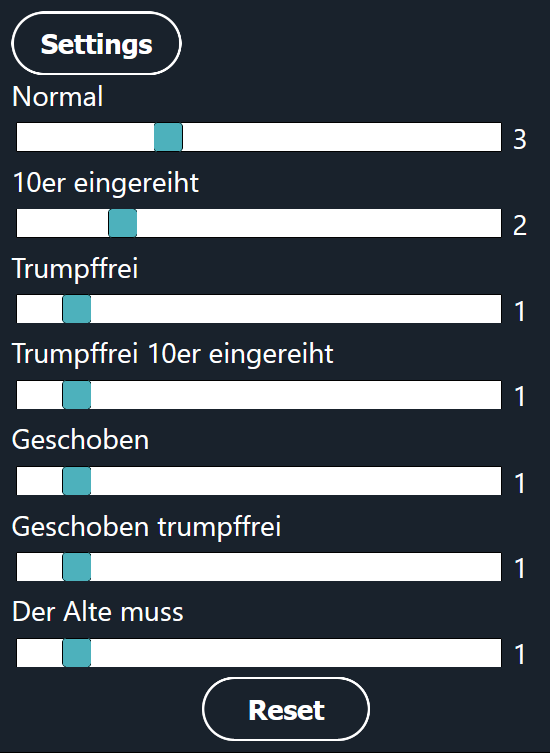

# Schafkopf Ramsch Picker
Simple website for choosing a random gamemode for playing Ramsch during a match of Schafkopf.

## Features
The button for picking a gamemode shows a brief raffling animation and disables the button in the meantime. 
After the gamemode is picked the cards underneath fan out and the button for picking a gamemode is enabled again. 

In the settings the weight of the gamemodes can be set. The reset button sets all gamemodes to a weight of 1. 

The website is best used in mobile view and desktop view is ignored here.

## Known limitations
The settings are not persistent after reloading the page in Chrome. Best experience with Firefox.